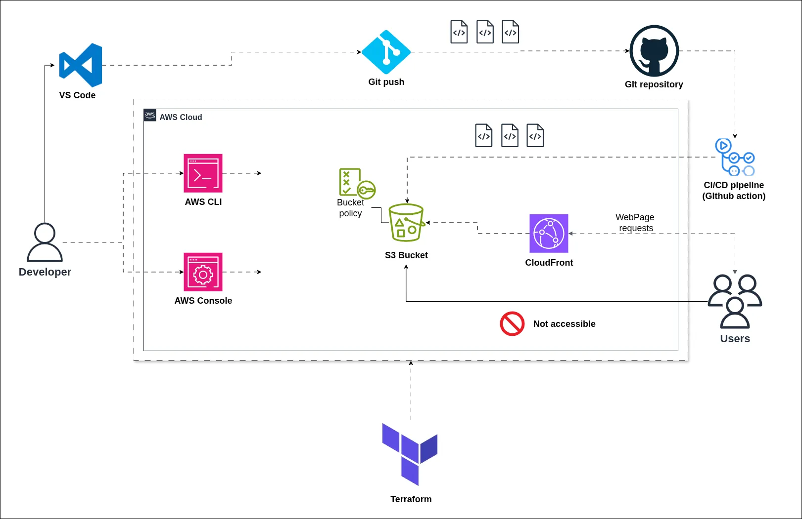

# CineQuest – Movie Search App

**CineQuest** is a **modern, high-performance movie search application** built with **React and Vite**. It allows users to effortlessly discover movies and access detailed information about them, including ratings, cast, synopsis, and more.

It consumes the **TMDB public API** directly from the frontend, and is deployed on **AWS**.

## Features

- Fast frontend with `Vite` + `React`
- Movie search interface using [TMDB API](https://www.themoviedb.org/)
- Result list with posters, titles, synopsis, release year, etc.
- Pagination

- Animations with `Framer motion`
- Favorites saved locally via `localStorage`
- Detail pages for each movie
- **Responsive** interface and clean design, including **dark mode** thanks to `Tailwind CSS`
- Secure static hosting with **S3 + CloudFront + OAC**
- **CI/CD pipeline with GitHub Actions**:
  - Build + upload to S3
  - Invalidate CloudFront cache after each deployment
- Infrastructure managed with **Terraform**

## Technologies Used

| Layer          | Stack                                         |
| -------------- | --------------------------------------------- |
| Frontend       | React, Vite, Tailwind CSS, Framer motion      |
| API            | [TMDB API](https://developers.themoviedb.org) |
| Hosting        | AWS S3 (private bucket)                       |
| CDN / HTTPS    | AWS CloudFront + Origin Access Control        |
| Infrastructure | Terraform (IaC)                               |
| CI/CD          | GitHub Actions                                |

## Architecture Diagram



## Useful Resources

- [React Documentation](https://react.dev/)
- [Tailwind CSS Docs](https://tailwindcss.com/docs)
- [Framer motion docs](https://motion.dev/docs)
- [Terraform AWS Provider Docs](https://registry.terraform.io/providers/hashicorp/aws/latest/docs)
- [IAM docs](https://docs.aws.amazon.com/iam/)
- [AWS CLI Docs](https://docs.aws.amazon.com/cli/latest/userguide/cli-configure-quickstart.html)
- [S3 docs](https://docs.aws.amazon.com/s3/)
- [CloudFront docs](https://docs.aws.amazon.com/cloudfront/)
- [GitHub Actions Docs](https://docs.github.com/en/actions)
- [TMDB Developer Docs](https://developers.themoviedb.org)

# How to Test the App

To test the CineQuest movie search app locally or contribute to its development, follow the steps below.

- **Local**
- **AWS without Terraform (main branch)**
- **AWS with Terraform (main-tf branch)**

## Local Deployment

### 1. **Clone the Repository**

```bash
git clone https://github.com/rdplus2015/cineQuest.git
cd cinequest/app
```

### 2. **Install Dependencies**

```bash
npm install
```

### 3. **Add Your API Key**

Create a `.env` file at the root of the `app/` directory:

```env
VITE_TMDB_API_KEY=your_tmdb_api_key_here
```

You can obtain an API key from [TMDB's developer page](https://developers.themoviedb.org/).

### 4. **Run the Development Server**

```bash
npm run dev
```

This will launch the app at [http://localhost:5173](http://localhost:5173).

## Deploy to AWS without Terraform (Main Branch)

This method uses GitHub Actions to automate deployment to S3 + CloudFront.

Make sure you are on the main branch:

```bash
git branch
```

### Prerequisites

- AWS account with:

  - An **IAM user** with programmatic access and full permissions on **S3** and **CloudFront**.
    This is covered under the free-tier.

  - An S3 bucket:

    - Create the S3 bucket
    - Disable static hosting (because CloudFront is used)

    - Disable Block Public Access (required for CloudFront access)

  - A CloudFront distribution:

    - Create a CloudFront distribution manually
    - Associate it with the S3 bucket as origin
    - Enable **Origin Access Control (OAC)**. CloudFront will automatically update the bucket policy to restrict access to CloudFront only.

    - Enable HTTP to HTTPS redirection
    - Go to the **Error Pages** tab and configure custom responses for:
      - 403 → index.html
      - 404 → index.html

- GitHub Secrets:

  - `AWS_ACCESS_KEY_ID`

  - `AWS_SECRET_ACCESS_KEY`
  - `ÀPI_KEY`
  - **Note:** don't forget to update the s3 bucket name and CloudFront distribution name in your `deploy.yml`

### Deployment Steps

1. Push your code to the `main` branch.

2. GitHub Actions will:
   - Build the app with Vite and install all dependencies
   - Upload the contents of `dist/` to the S3 bucket
   - Remove outdated files (via `--delete` flag)
   - Invalidate CloudFront cache to reflect the new version
3. Open the CloudFront domain in your browser to access the app via HTTPS

### Note

If you want to deploy **without CloudFront**, using **only S3 static website hosting**:

- Enable **Static website hosting** in S3 bucket settings

- Use the **root AWS account** to assign the following inline policy to your IAM user: `access-analyzer:ValidatePolicy`

```json
{
  "Version": "2012-10-17",
  "Statement": [
    {
      "Sid": "VisualEditor0",
      "Effect": "Allow",
      "Action": "access-analyzer:ValidatePolicy",
      "Resource": "*"
    }
  ]
}
```

- Disable Block Public Access

- Add a bucket policy that allows public access to the objects

```json
{
  "Version": "2012-10-17",
  "Statement": [
    {
      "Sid": "AllowPublicRead",
      "Effect": "Allow",
      "Principal": "*",
      "Action": "s3:GetObject",
      "Resource": "arn:aws:s3:::cinequest/*"
    }
  ]
}
```

## Deploy with Terraform (Main-tf Branch)

This method provisions the infrastructure automatically using Terraform.

### Prerequisites

- Install and configure the **AWS CLI**
- Install the **Terraform CLI**

- The Terraform configuration files are included in the `infrastructure/` directory of this repository

Switch to the correct branch:

```bash
git checkout main-tf
```

### Deployment Steps

1. Navigate to the Terraform project directory:

```bash
cd infrastructure
```

2. Initialize the workspace:

```bash
terraform init
```

3. Apply the configuration:

```bash
terraform apply
```

**Note:** All Terraform commands must be entered in a CLI where AWS CLI is configured. Terraform will use those credentials.

Terraform will provision:

- An S3 bucket with appropriate configuration

- A CloudFront distribution with HTTPS and Origin Access Control

4. Push your app code to the `main-tf` branch

5. GitHub Actions will automatically build and deploy the frontend to the infrastructure provisioned by Terraform

### Note

If you are using a private API key, do not store it in GitHub secrets and inject it on the frontend, because it will still be visible in browser dev tools.

## Author contact

- [LinkedIn](https://www.linkedin.com/in/ridi-otoko-624a401a2/)

## License

This project is licensed under the MIT License. See the +LICENSE+
